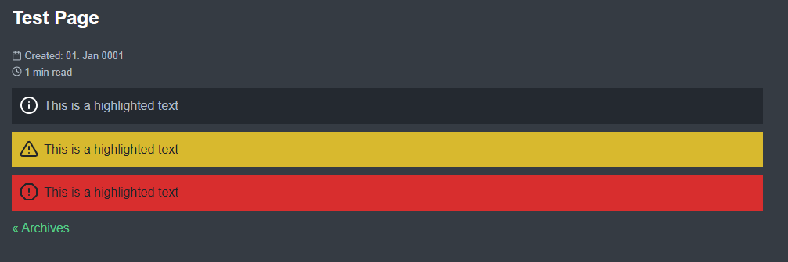

# Highlight boxes in Hugo

Add Highlight Boxes to your Website

## Install

1. Add the shortcode files to `layouts/shortcodes`
2. Add the css code to your project
3. Add the icon vector files in your project to `/static`

## Usage

```hugo

    This is a highlighted text

```

```hugo

    Make sure the Public Key is known to the Git Server.

```

```hugo

    This is a highlighted text

```

## Preview

