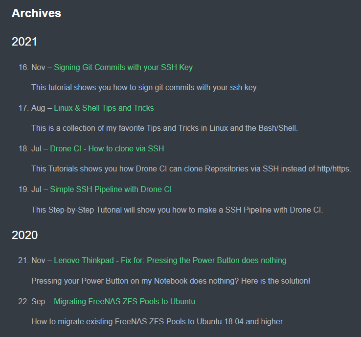

# Post Archive in Hugo

Add an Archive of your Posts to your Website

## Install

1. Add the shortcode file `shortcodes/archive.html` to your project > `layouts/shortcodes`
2. Add `content/archive.md` to your project's `/content` directory 

## Usage

To reach your Archive you can add a new menu entry that links to it:

```toml
[menu]
    [[menu.main]]
        identifier = "about"
        name = "About"
        url = "/about/"
```

Add a summary (description) to each Post:
```toml
+++
...
summary = "This is a Test Page for this Usage example"
...
+++
``` 

## Preview

